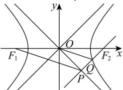

<!-- question-source:start -->
【87】已知双曲线 $C: \frac{x^{2}}{a^{2}} - \frac{y^{2}}{b^{2}} = 1 (a > 0, b > 0)$ 的左、右焦点分别为 $F_{1}, F_{2}$ ，点 Q 在 C 的右支上， $QF_{2}$ 与 C 的一条渐近线平行，交 C 的另一条渐近线于点 P，若 $OQ \parallel PF_{1}$ ，则 C 的离心率为（）

A. $\sqrt{2}$ B. $\sqrt{3}$ C. 2 D. $\sqrt{5}$
<!-- question-source:end -->
