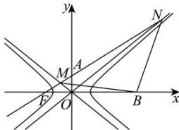

<!-- question-source:start -->
【100】（2024·河北三模）如图, 双曲线 $\Gamma:\frac{x^{2}}{a^{2}}-\frac{y^{2}}{b^{2}}=1$ $(a>0,b>0)$ 的左焦点 $F(-c,0)$ ，且 $A(0,b)$ ， $B(3c,0)$ ，直线 FA 分别与双曲线的两条渐近线交于 M, N 两点. 若 BM=BN，则双曲线 $\Gamma$ 的离心率为（）

A. $\frac{\sqrt{6}}{2}$ B. $\frac{2\sqrt{3}}{3}$ C. $\frac{\sqrt{5}}{2}$ D. $\sqrt{3}$
<!-- question-source:end -->

![[Q00008469A1]]
