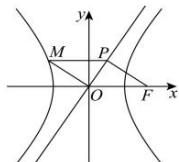

<!-- question-source:start -->
【101】（2024·江西赣州高三下期中）如图，已知双曲线 $C: \frac{x^{2}}{a^{2}} - \frac{y^{2}}{b^{2}} = 1 (a > 0, b > 0)$ 的右焦点为 F，点 P 是双曲线 C 的渐近线上的一点，点 M 是双曲线 C 左支上的一点。若四边形 OFPM 是一个平行四边形，且 $OM \perp OP$ ，则双曲线 C 的离心率是（）

A. $\sqrt{3}$ B. 2 C. $\sqrt{5}$ D. 3
<!-- question-source:end -->
