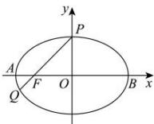

> [!faq]- 全练一本通解析
> **【答案】** D
>
> **【解析】**
> 解析:由题意可得 $P(0,b), F(-c,0)$ ,
> 由于 $|PF|=3|QF|$ ，所以 $y_{Q}=-\frac{1}{3}b, x_{Q}=-\frac{4}{3}c$ 由于 Q 在椭圆上，所以 $\frac{\left(-\frac{4}{3}c\right)^{2}}{a^{2}}+\frac{\left(-\frac{1}{3}b\right)^{2}}{b^{2}}=1$ ，化简可得 $\frac{c^{2}}{a^{2}}=\frac{1}{2}\Rightarrow e^{2}=\frac{1}{2}$ ，由于 0<e<1，故 $e=\frac{\sqrt{2}}{2}$ ，故选：D
> 
