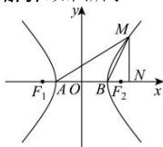

> [!faq]- 全练一本通解析
> **【答案】** D
>
> **【解析】**
> 解析:如图所示:
> 
> 因为 $\triangle ABM$ 为等腰三角形，且顶角为 $120^{\circ}$ 所以 $\left|AB\right| = \left|BM\right| = 2a, \angle ABM = 120^{\circ}$ ，过点 $M$ 作 $MN \perp x$ 轴，垂足为 $N$ 在 $Rt\triangle BMN$ 中，则 $\left|BN\right| = a, \left|MN\right| = \sqrt{3}a$ 故 $M(2a, \sqrt{3}a)$ ，代入双曲线方程得 $\frac{(2a)^2}{a^2} - \frac{(\sqrt{3}a)^2}{b^2} = 1$ ，解得 $a^2 = b^2$ ，即 $a^2 = c^2 - a^2$ 所以 $c^2 = 2a^2$ ，解得 $e = \sqrt{2}$ 。
>
> 故选 **D**
