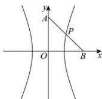

> [!faq]- 全练一本通解析
> **【答案】** D
>
> **【解析】**
> 解析:由题意得 P 为 AB 的中点, 因为 $A(0,b)$ , $B(c,0)$ ,
> 则 $P\left(\frac{c}{2},\frac{b}{2}\right)$ ，因为点 P 在双曲线上，则代入双曲线方程有 $\frac{\left(\frac{c}{2}\right)^{2}}{a^{2}}-\frac{\left(\frac{b}{2}\right)^{2}}{b^{2}}=1$ ，化简得 $c^{2}=5a^{2}$ ，则 $e^{2}=5$ ， $e=\sqrt{5}$ 。故选：D.
> 
