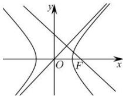

> [!faq]- 全练一本通解析
> **【答案】** C
>
> **【解析】**
> 解析:不妨设双曲线的一个焦点为 $F(c,0)$ ，渐近线为 $y=\frac{b}{a}x$ ，
> 则过点 $F(c,0)$ 且与直线 $y=\frac{b}{a}x$ 垂直的直线方程为 $y=-\frac{a}{b}(x-c)$ ，令 x=0，则 $y=\frac{ac}{b}$ ，
> 则 $\frac{ac}{b}=3c$ ，所以 $\frac{b}{a}=\frac{1}{3}$ ，
> 所以此双曲线的离心率是 $\frac{c}{a}=\sqrt{1+\frac{b^{2}}{a^{2}}}=\sqrt{1+\frac{1}{9}}=\frac{\sqrt{10}}{3}$ . 故选：C.
> 
