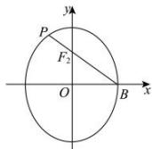

> [!faq]- 全练一本通解析
> **【答案】** A
>
> **【解析】**
> 解析: 令椭圆半焦距为 c，依题意， $B(b,0), F_{2}(0,c)$ ，由 $\overline{BF_{2}}=2\overline{F_{2}P}$ ，得 $\overline{F_{2}P}=\frac{1}{2}(-b,c)=(-\frac{b}{2},\frac{c}{2})$ 则 $P(-\frac{b}{2},\frac{3c}{2})$ ，而点 P 在椭圆上，于是 $\frac{1}{4}+\frac{9}{4}\cdot\frac{c^{2}}{a^{2}}=1$ ，解得 $e=\frac{c}{a}=\frac{\sqrt{3}}{3}$ ，
> 所以 C 的离心率为 $\frac{\sqrt{3}}{3}$ . 故选: A
> 
