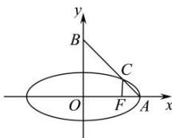

> [!faq]- 全练一本通解析
> **【答案】** B
>
> **【解析】**
> 解析:加图
> 解析:如图,
> 
> $A(a,0),B(0,2b)$ ，则 $AB:\frac{x}{a}+\frac{y}{2b}=1$ 在椭圆 $\frac{x^{2}}{a^{2}} + \frac{y^{2}}{b^{2}} = 1$ 中，取 x = c，可得 $y = \pm \frac{b^{2}}{a}$ ，则 $C\left(c, \frac{b^{2}}{a}\right)$ ，把 $C\left(c, \frac{b^{2}}{a}\right)$ 代入 $\frac{x}{a} + \frac{y}{2b} = 1$ ，
> 可得 $\frac{c}{a}+\frac{b^{2}}{2ab}=1$ ，即 $\frac{c}{a}+\frac{b}{2a}=1$ ，
> ∴ b=2a-2c，则 $b^{2}=a^{2}-c^{2}=(2a-2c)^{2}=4a^{2}-8ac+4c^{2}$ ∴ $5e^{2}-8e+3=0$ 解得 $e=\frac{3}{5}$ （e=1 舍去）。
>
> 故选 **B**.
