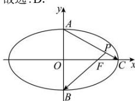

> [!faq]- 全练一本通解析
> **【答案】** D
>
> **【解析】**
> 解析: 设椭圆的半焦距为 c,
> 由题意可得： $A(0,b),B(0,-b),C(a,0),F(c,0)$ ,
> 可得： $\overrightarrow{FB}=(-c,-b),\overrightarrow{AC}=(a,-b)$ 由图可得： $\angle APB$ 即为 $\left\langle\overrightarrow{FB},\overrightarrow{AC}\right\rangle$ 的补角，
> 若 $\angle APB$ 为钝角，即 $\left\langle\overrightarrow{FB},\overrightarrow{AC}\right\rangle$ 为锐角，
> 由图可知 $\left\langle\overrightarrow{FB},\overrightarrow{AC}\right\rangle\neq0$ ，故原题意等价于 $\overrightarrow{FB}\cdot\overrightarrow{AC}=-ac+b^{2}=-ac+a^{2}-c^{2}>0$ 整理得 $e^{2}+e-1<0$ ，且 0<e<1 ，解得 $0<e<\frac{\sqrt{5}-1}{2}$ 所以椭圆的离心率的取值范围是 $\left(0,\frac{\sqrt{5}-1}{2}\right)$ .
> 故选:D.
> 
