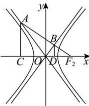

> [!faq]- 全练一本通解析
> **【答案】** C
>
> **【解析】**
> 解析:不妨设 A 在第二象限, 如图, AC,BD 垂直于 x 轴,
> -2a 代入 $y=-\frac{b}{a}x$ , 可得 $y_{0}=2b$ , 可知 $A(-2a,2b)$ ,
> 直线 l 过点 F 且与该双曲线的渐近线分别交于点 $A(-2a,y_{0}), B\left(x,\frac{y_{0}}{3}\right)$ ,
> 则 $\left|BD\right|=\frac{1}{3}\left|AC\right|$ ，所以 $B\left(\frac{2c-2a}{3},\frac{2b}{3}\right)$ ,
> 又 B 在双曲线的渐近线 $y=\frac{b}{a}x$ 上，
> 可得 $\frac{2b}{3}=\frac{b}{a}\times\frac{2c-2a}{3}$ 解得 $\frac{c}{a}=2$ ，即双曲线的离心率为 2.
> 
