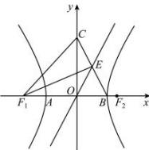

> [!faq]- 全练一本通解析
> **【答案】** A
>
> **【解析】**
> 解析: 双曲线 $C: \frac{x^{2}}{a^{2}} - \frac{y^{2}}{b^{2}} = 1 (a > 0, b > 0)$ 的渐近线方程为 $y = \pm \frac{b}{a} x$ ，由 $B(a,0), C(0,b)$ ，可得直线 CB 的方程为 $bx + ay = ab$ ，
> 
> 联立渐近线方程 $y=\frac{b}{a}x$ 解得 $E\left(\frac{a}{2},\frac{b}{2}\right)$ ，即有 E 为 CB 的中点，
> 由 $\angle BF_{1}E = \angle CF_{1}E$ ，即 $F_{1}E$ 平分 $\angle CF_{1}B$ ，可得三角形 $CF_{1}B$ 为等腰三角形，
> 即有 $CF_{1}=BF_{1}$ ，即 $\sqrt{b^{2}+c^{2}}=a+c$ 又 $a^{2}+b^{2}=c^{2}$ ，可得 $c^{2}=2a^{2}+2ac$ 由 $e=\frac{c}{a}$ 可得 $e^{2}-2e-2=0$ ，解得 $e=1+\sqrt{3}$ .
>
> 故选 **A**.
