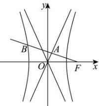

> [!faq]- 全练一本通解析
> **【答案】** 详见解析
>
> **【解析】**
> $\frac{5}{3}$
> 
> 由右焦点 $F$ 作一条渐近线的垂线，可设直线方程为： $y = -\frac{a}{b} (x - c)$ ，与该渐近线方程： $y = \frac{b}{a} x$ ，联立方程组解得： $\left\{ \begin{array}{l} x = \frac{a^2}{c} \\ y = \frac{ab}{c} \end{array} \right.$ ，即点 $A$ 坐标为 $\left(\frac{a^2}{c}, \frac{ab}{c}\right)$ ，再设点 $B(x_0, y_0)$ ，则由 $\overline{FB} = 4\overline{FA}$ 可得： $(x_0 - c, y_0) = 4\left(\frac{a^2}{c} - c, \frac{ab}{c}\right)$ ，即 $x_0 = 4\frac{a^2}{c} - 3c, y_0 = 4\frac{ab}{c}$ ，把该点 $B(x_0, y_0)$ 代入椭圆方程可得： $\frac{\left(4\frac{a^2}{c} - 3c\right)^2}{a^2} - \frac{\left(4\frac{ab}{c}\right)^2}{b^2} = 1$ ，化简得： $\left(4\frac{a}{c} - 3\frac{c}{a}\right)^2 - \left(4\frac{a}{c}\right)^2 = 1$ ，由双曲线的离心率 $e = \frac{c}{a}$ 可得： $\left(\frac{4}{e} - 3e\right)^2 - \left(\frac{4}{e}\right)^2 = 1$ ，解得： $e^2 = \frac{25}{9}$ ，因为双曲线的离心率 $e > 1$ ，所以 $e = \frac{5}{3}$ .
