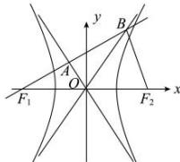

> [!faq]- 全练一本通解析
> **【答案】** B
>
> **【解析】**
> 解析:由题意可知, 过 $F_{1}$ 的直线与 C 的两条渐近线分别交于 A, B 两点, 当两个交点分别在第二和第三象限时不符合,
> A 为线段 $BF_{1}$ 的中点, 当交点在 x 轴上方或 x 轴下方时, 根据对称性结果是一样的, 选择一种即可, 如图.
> 
> 根据双曲线可得， $F_{1}(-c,0)$ ， $F_{2}(c,0)$ ，两条渐近线方程 $y=\pm\frac{b}{a}x$ ，
> ∵ $BF_{1} \perp BF_{2}$ ，O 为 $F_{1}F_{2}$ 的中点，
> ∴ $BO = OF_{1} = OF_{2} = c$ ，又∵ A 为线段 $BF_{1}$ 的中点，∴ OA 垂直平分 $BF_{1}$ ，
> 可设直线 $BF_{1}$ 为 $y=\frac{a}{b}(x+c)$ ①，直线 $BF_{2}$ 为 $y=-\frac{b}{a}(x-c)$ ②，直线 BO 为 $y=\frac{b}{a}x$ ③，
> 由②③得，交点坐标 $B(\frac{c}{2},\frac{bc}{2a})$ ，点 B 还在直线 $BF_{1}$ 上，∴ $\frac{bc}{2a}=\frac{a}{b}(\frac{c}{2}+c)$ ，
> 可得 $b^{2}=3a^{2}$ , $c^{2}=a^{2}+b^{2}=4a^{2}$ ，所以双曲线 C 的离心率 $e=\frac{c}{a}=2$ ，
>
> 故选 **B**
