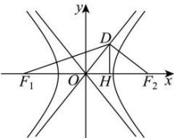

> [!faq]- 全练一本通解析
> **【解析】**
> $\frac{1}{3}$ 解析:不妨设焦点 $F_{2}(c,0)$ ，其中一条渐近线为 $y=\frac{b}{a}x$ ，则直线 l 的方程为 $y=-\frac{a}{b}(x-c)$ ，
> 由 $\left\{\begin{aligned}y&=\frac{b}{a}x,\\ y&=-\frac{a}{b}(x-c),\end{aligned}\right.$ 解得 $\left\{\begin{aligned}x&=\frac{a^{2}}{c},\\ y&=\frac{ab}{c},\end{aligned}\right.$ 即 $D\left(\frac{a^{2}}{c},\frac{ab}{c}\right)$ ,
> 因为 $e=\sqrt{\frac{c^{2}}{a^{2}}}=\sqrt{\frac{a^{2}+b^{2}}{a^{2}}}=\sqrt{1+\left(\frac{b}{a}\right)^{2}}=\sqrt{5}$ ，所以 $\frac{b}{a}=2$ ，过点 D 作 x 轴的垂线，垂足为 H，如下图：
> 
> 于是 $\tan \angle DF_1F_2 = \frac{|DH|}{|F_1H|} = \frac{\frac{ab}{c}}{c + \frac{a^2}{c}} = \frac{\frac{b}{a}}{2 + \left(\frac{b}{a}\right)^2} = \frac{2}{2 + 4} = \frac{1}{3}$ .
