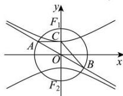

> [!faq]- 全练一本通解析
> **【答案】** C
>
> **【解析】**
> 解析:由题意知以 $F_{1}F_{2}$ 为直径的圆的方程为 $x^{2}+y^{2}=c^{2}$ ,
> 根据对称性, 不妨设一条渐近线方程为 $y=-\frac{a}{b}x$ , A 在第二象限,
> 联立 $\left\{\begin{aligned}y&=-\frac{a}{b}x\\ x^{2}+y^{2}&=c^{2}\end{aligned}\right.$ ，解得 $\left\{\begin{aligned}x&=-b\\ y&=a\end{aligned}\right.$ 或 $\left\{\begin{aligned}x&=b\\ y&=-a\end{aligned}\right.$ 则 $A(-b,a), B(b,-a)$ ，又 $C(0,a)$ ，
> 所以 $\overrightarrow{CA} = (-b,0), \overrightarrow{CB} = (b,-2a)$ 则 $\cos\angle ACB=\frac{\overrightarrow{CA}\cdot\overrightarrow{CB}}{\left|\overrightarrow{CA}\right|\left|\overrightarrow{CB}\right|}=\frac{-b^{2}}{b\sqrt{b^{2}+4a^{2}}}=-\frac{1}{2}$ ，即 $b^{2}=\frac{4}{3}a^{2}$ ，
> 所以离心率 $e=\frac{c}{a}=\sqrt{\frac{c^{2}}{a^{2}}}=\sqrt{\frac{a^{2}+b^{2}}{a^{2}}}=\sqrt{\frac{7}{3}}=\frac{\sqrt{21}}{3}$ . 故选:C.
> 
