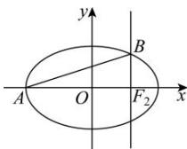

> [!faq]- 全练一本通解析
> **【答案】** A
>
> **【解析】**
> 解析:由题意得 $F_{2}(c,0)$ ， $A(-a,0)$ ，
> 将 x=c 代入 $\frac{x^{2}}{a^{2}}+\frac{y^{2}}{b^{2}}=1$ 得， $\frac{y^{2}}{b^{2}}=1-\frac{c^{2}}{a^{2}}=\frac{b^{2}}{a^{2}}$ 解得 $y=\pm\frac{b^{2}}{a}$ ,
> 因为 B 在第一象限, 故 $B\left(c,\frac{b^{2}}{a}\right)$ ,
> 故 AB 的斜率为 $\frac{\frac{b^{2}}{a}-0}{c+a}=\frac{b^{2}}{ac+a^{2}}$ 因为直线 AB 的斜率的取值范围是 $\left[\frac{1}{4},\frac{1}{3}\right]$ ，
> 所以 $\frac{b^{2}}{ac+a^{2}}\in\left[\frac{1}{4},\frac{1}{3}\right]$ ,
> 因为 $b^{2} = a^{2} - c^{2}$ ，所以 $\frac{a^2 - c^2}{ac + a^2}\in \left[\frac{1}{4},\frac{1}{3}\right]$ $\frac{a^2 - c^2}{ac + a^2}\geq \frac{1}{4}$ ，变形得到 $4c^{2} + ac - 3a^{2}\leq 0$ 不等式两边同除以 $a^2$ 得， $4e^{2} + e - 3\leq 0$ ，解得 $0 <   e\leq \frac{3}{4}$ $\frac{a^2 - c^2}{ac + a^2}\leq \frac{1}{3}$ ，变形得到 $3c^{2} + ac - 2a^{2}\geq 0$ 不等式两边同除以 $a^2$ 得， $3e^{2} + e - 2\geq 0$ ，解得 $\frac{2}{3}\leq e <   1$ ，故 $e\in \left[\frac{2}{3},\frac{3}{4}\right].$
> 
>
> 故选 **A**
