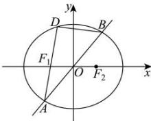

> [!faq]- 全练一本通解析
> **【答案】** B
>
> **【解析】**
> 解析：∵ 直线 l: y=kx 经过原点，∴ 设 $A(x_{1},y_{1})$ ， $B(-x_{1},-y_{1})$ ， $D(x_{2},y_{2})$ 。
> ∴ $k_{AD} \cdot k_{BD} = \frac{y_{2} - y_{1}}{x_{2} - x_{1}} \cdot \frac{y_{2} + y_{1}}{x_{2} + x_{1}} = \frac{y_{2}^{2} - y_{1}^{2}}{x_{2}^{2} - x_{1}^{2}}$ 又∵ $\frac{x_{1}^{2}}{a^{2}}+\frac{y_{1}^{2}}{b^{2}}=1,\quad\frac{x_{2}^{2}}{a^{2}}+\frac{y_{2}^{2}}{b^{2}}=1$ ，∴两式相减，得 $\frac{x_{1}^{2}-x_{2}^{2}}{a^{2}}+\frac{y_{1}^{2}-y_{2}^{2}}{b^{2}}=0$ ∴ $\frac{y_{1}^{2}-y_{2}^{2}}{x_{1}^{2}-x_{2}^{2}}=-\frac{b^{2}}{a^{2}}$ ，∴ $k_{AD} \cdot k_{BD} = -\frac{b^{2}}{a^{2}} = -\frac{1}{2}$ . ∴ 离心率为 $e=\sqrt{1-\frac{b^{2}}{a^{2}}}=\frac{\sqrt{2}}{2}$ .
> 故选：B.
> 
