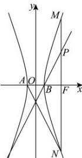

> [!faq]- 全练一本通解析
> **【答案】** B
>
> **【解析】**
> 解析:由题可
> 得： $A(-a,0)$ ， $B(a,0)$ ， $F(c,0)$ ， $M(c,\frac{b^{2}}{a})$ ， $N(c,-\frac{b^{2}}{a})$ ， $P(c,\frac{b^{2}}{2a})$ ，
> 
> 所以 $k_{BP}=\frac{\frac{b^{2}}{2a}}{c-a}=\frac{c+a}{2a}$ ，直线 BP 的方程为： $y=\frac{c+a}{2a}(x-a)$ ，
> 令 x=0，解得： $y=-\frac{c+a}{2}$ ，所以直线 BP 与 y 轴交点为 $\left(0,-\frac{c+a}{2}\right)$ ，
> 由于 $k_{AN}=\frac{-\frac{b^{2}}{a}}{c+a}=-\frac{c-a}{a}$ ，则直线 AN 的方程为： $y=-\frac{c-a}{a}(x+a)$ ，
> 令 x=0，解得：y=a-c，所以直线 AN 与 y 轴交点为 $(0,a-c)$ ，
> 因为直线 BP 与直线 AN 的交点在 y 轴上，所以 $a-c=-\frac{c+a}{2}$ ，解得：c=3a，所以双曲线 E 的离心率 $e=\frac{c}{a}=3$ ，
>
> 故选 **B**
