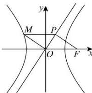

> [!faq]- 全练一本通解析
> **【答案】** A
>
> **【解析】**
> 解析: 因为四边形 OFPM 是一个平行四边形, 且 $OM \perp OP$ , 可得 $\angle OPF = 90^{\circ}$ , 即 $FP \perp OP$ ,
> 由双曲线 $C:\frac{x^{2}}{a^{2}}-\frac{y^{2}}{b^{2}}=1$ , 可得 $F(\mathrm{c},0)$ , 渐近线方程为 $y=\frac{b}{a}x$ , 即 bx-ay=0,
> 可得 $\left|PF\right|=\frac{\left|bc\right|}{\sqrt{b^{2}+a^{2}}}=\frac{\left|bc\right|}{\sqrt{c^{2}}}=b$ , 且 $\left|OP\right|=\sqrt{\left|OF\right|^{2}-\left|PF\right|^{2}}=\sqrt{c^{2}-b^{2}}=a$ 因为直线 OP: $y=\frac{b}{a}x$ , 可得 $P(\frac{a^{2}}{c},\frac{ab}{c})$ ,
> 又因为 $\left|MP\right|=\left|OF\right|=c$ , 所以 $M\left(\frac{a^{2}}{c}-c,\frac{ab}{c}\right)$ 即 $\left(-\frac{b^{2}}{c},\frac{ab}{c}\right)$ ,
> 代入双曲线 C 方程, 可得 $\frac{b^{4}}{a^{2}c^{2}}-\frac{a^{2}b^{2}}{b^{2}c^{2}}=1$ , 整理得 $b^{4}-a^{4}=a^{2}c^{2}$ ,
> 所以 $b^{4}-a^{4}=a^{2}(a^{2}+b^{2})$ , 可得 $b^{2}-a^{2}=a^{2}$ , 即 $\frac{b^{2}}{a^{2}}=2$ ,
> 所以离心率 $e=\sqrt{1+\frac{b^{2}}{a^{2}}}=\sqrt{3}$ . 故选：A.
> 
