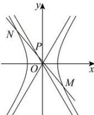

> [!faq]- 全练一本通解析
> **【答案】** BC
>
> **【解析】**
> 解析:由题意知 $-\frac{b}{a} \neq -3$ ，即 $-\frac{\sqrt{c^{2}-a^{2}}}{a} \neq -3$ ，所以 $e \neq \sqrt{10}$ ，设 $M(x_{1}, y_{1}), N(x_{2}, y_{2})$ ，
> 由 $\left\{\begin{aligned}y&=-3x+m\\ \frac{x^{2}}{a^{2}}-\frac{y^{2}}{b^{2}}=1\end{aligned}\right.$ ，得 $(b^{2}-9a^{2})x^{2}+6ma^{2}x-a^{2}m^{2}-a^{2}b^{2}=0$ $\Delta=\left(6ma^{2}\right)^{2}+4\left(b^{2}-9a^{2}\right)\left(a^{2}m^{2}+a^{2}b^{2}\right)=4a^{2}b^{2}\left(m^{2}+b^{2}-9a^{2}\right)>0$ 则 $x_{1}+x_{2}=-\frac{6ma^{2}}{b^{2}-9a^{2}}$ $y_{1}+y_{2}=-3(x_{1}+x_{2})+2m=\frac{18ma^{2}+2m\left(b^{2}-9a^{2}\right)}{b^{2}-9a^{2}}=\frac{2mb^{2}}{b^{2}-9a^{2}}$ 得 $P\left(-\frac{3ma^{2}}{b^{2}-9a^{2}},\frac{mb^{2}}{b^{2}-9a^{2}}\right)$ ，所以 $k_{OP}=\frac{mb^{2}}{-3ma^{2}}=\frac{b^{2}}{-3a^{2}}<-1$ ，
> 即 $b^{2}>3a^{2}, c^{2}-a^{2}>3a^{2}$ ，可得 e>2 且 $e\neq\sqrt{10}$ 。故选：BC
> 
