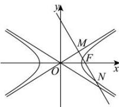

> [!faq]- 全练一本通解析
> **【答案】** $\frac{2\sqrt{3}}{3}$
>
> **【解析】**
> 易知 $F(c,0)$ ，如图，由对称性不妨设直线 $MN:ty=x-c(t<0)$ , $M(x_{1},y_{1})(y_{1}>0)$ , $N(x_{2},y_{2})$ ,
> 由 $\left\{\begin{aligned}\frac{x^{2}}{a^{2}}-\frac{y^{2}}{b^{2}}=0\\ ty=x-c\end{aligned}\right.$ ，消x得到 $(b^{2}t^{2}-a^{2})y^{2}+2b^{2}tcy+b^{2}c^{2}=0$ 则 $y_{1} + y_{2} = -\frac{2b^{2}tc}{b^{2}t^{2} - a^{2}}, y_{1}y_{2} = \frac{b^{2}c^{2}}{b^{2}t^{2} - a^{2}}$ 因为 $\overline{MN}=3\overline{MF}$ ，所以 $(x_{2}-x_{1},y_{2}-y_{1})=3(c-x_{1},-y_{1})$ ，得到 $y_{2}-y_{1}=-3y_{1}$ ，即 $y_{2}=-2y_{1}$ ，
> 将 $y_{2} = -2y_{1}$ 代入 $y_{1} + y_{2} = -\frac{2b^{2}tc}{b^{2}t^{2} - a^{2}},y_{1}y_{2} = \frac{b^{2}c^{2}}{b^{2}t^{2} - a^{2}}$ ，整理得到 $9b^{2}t^{2} = a^{2}$ 又易知 $t = -\frac{b}{a}$ ，所以 $9b^{2}(-\frac{b}{a})^{2} = a^{2}$ ，得到 $3b^{2} = a^{2}$ ，即 $\frac{b^2}{a^2} = \frac{1}{3}$ 所以双曲线的离心率 $e = \frac{c}{a} = \sqrt{1 + \frac{b^2}{a^2}} = \sqrt{1 + \frac{1}{3}} = \frac{2\sqrt{3}}{3}$
> 
> 故答案: $\frac{2\sqrt{3}}{3}$ .
