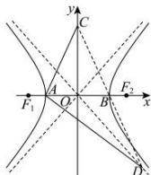

> [!faq]- 全练一本通解析
> **【答案】** $\frac{\sqrt{7}}{2}$
>
> **【解析】**
> 易知 $A(-a,0)$ , $B(a,0)$ ，不妨设 $l_{AC}: y = k(x + a)(k > 0)$ ， $l_{AD}: y = -\frac{1}{k}(x + a)$ ，
> 由 $l_{AC}: y = k(x + a)$ ，令 x = 0，得到 y = ka，所以 $C(0,ka)$ ，
> 又易知双曲线的渐近线方程为 $y=\pm\frac{b}{a}x$ ，由 $\left\{\begin{aligned}y&=-\frac{1}{k}(x+a)\\ y&=-\frac{b}{a}x\end{aligned}\right.$ ，得到 $x=\frac{a^{2}}{kb-a}$ ， $y=-\frac{ab}{kb-a}$ ，所以 $D(\frac{a^{2}}{kb-a},-\frac{ab}{kb-a})$ 由题有 $\left\{\begin{aligned}\frac{a^{2}}{kb-a}&=2a\\ ka-\frac{ab}{kb-a}&=0\end{aligned}\right.$ ，消 k 整理得到 $3a^{2}-4b^{2}=0$ ，得到 $\frac{b^{2}}{a^{2}}=\frac{3}{4}$ ，
> 所以双曲线的离心率 $e=\frac{c}{a}=\sqrt{1+\frac{b^{2}}{a^{2}}}=\sqrt{1+\frac{3}{4}}=\frac{\sqrt{7}}{2}$
> 
> 故答案为: $\frac{\sqrt{7}}{2}$ .
