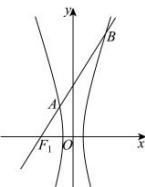

> [!faq]- 全练一本通解析
> **【解析】**
> 4
> 解析: 可知直线 $y=\sqrt{3}(x+c)$ 过左焦点 $F_{1}(-c,0)$ ，斜率 $k=\sqrt{3}$
> 
> 且直线与双曲线 E 相交, 可知 $\frac{b}{a} > \sqrt{3}$ , 则 $e = \frac{c}{a} = \sqrt{1 + \left(\frac{b}{a}\right)^2} > 2$ ,
> 联立方程 $\left\{\begin{aligned}y&=\sqrt{3}(x+c)\\ \frac{x^{2}}{a^{2}}-\frac{y^{2}}{b^{2}}=1\end{aligned}\right.$ ，消去x可得 $\left(b^{2}-3a^{2}\right)y^{2}-2\sqrt{3}b^{2}cy+3b^{4}=0$ 设 $A(x_{1},y_{1}),B(x_{2},y_{2})$ ，则 $y_{1}+y_{2}=\frac{2\sqrt{3}b^{2}c}{b^{2}-3a^{2}},y_{1}y_{2}=\frac{3b^{4}}{b^{2}-3a^{2}}$ 由 $\overline{F_{1}B}=3\overline{F_{1}A}$ 可知 $y_{2}=3y_{1}$ 与 $y_{1}+y_{2}=\frac{2\sqrt{3}b^{2}c}{b^{2}-3a^{2}}$ 联立可得 $y_{2}=3y_{1}=\frac{3\sqrt{3}b^{2}c}{2(b^{2}-3a^{2})}$ 代入 $y_{1}y_{2}=\frac{3b^{4}}{b^{2}-3a^{2}}$ 可得 $3\left[\frac{\sqrt{3}b^{2}c}{2(b^{2}-3a^{2})}\right]^{2}=\frac{3b^{4}}{b^{2}-3a^{2}}$ ，则 $c^{2}=16a^{2}$ ，
> 所以双曲线E的离心率 $e=\frac{c}{a}=\sqrt{\frac{c^{2}}{a^{2}}}=4$ ;
