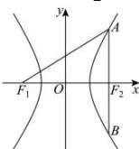

> [!faq]- 全练一本通解析
> **【答案】** $\frac{3}{2}$
>
> **【解析】**
> 由题可知 A, B, $F_{2}$ 三点横坐标相等，设 A 在第一象限，将 x=c 代入 $\frac{x^{2}}{a^{2}}-\frac{y^{2}}{b^{2}}=1$ 得 $y=\pm\frac{b^{2}}{a}$ ，即 $A\left(c,\frac{b^{2}}{a}\right),B\left(c,-\frac{b^{2}}{a}\right)$ ，故 $\left|AB\right|=\frac{2b^{2}}{a}=10,\left|AF_{2}\right|=\frac{b^{2}}{a}=5$ ，又 $\left|AF_{1}\right|-\left|AF_{2}\right|=2a$ ，得 $\left|AF_{1}\right|=\left|AF_{2}\right|+2a=2a+5=13$ ，解得 a=4，代入 $\frac{b^{2}}{a}=5$ 得 $b^{2}=20$ ，故 $c^{2}=a^{2}+b^{2}=36$ ，即 c=6，所以 $e=\frac{c}{a}=\frac{6}{4}=\frac{3}{2}$ .
> 故答案为： $\frac{3}{2}$
> 
