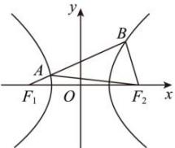

<!-- question-source:start -->
【29】（2023·江西南昌二模）如图， $F_{1}$ 、 $F_{2}$ 是双曲线 $\frac{x^{2}}{a^{2}}-\frac{y^{2}}{b^{2}}=1(a>0,b>0)$ 的左、右焦点，过 $F_{1}$ 的直线l与双曲线的左、右两支分别交于点A,B，若 $\left|BF_{2}\right|=6$ ， $\left|AB\right|=8,\left|AF_{2}\right|=10$ ，则双曲线的离心率为（）

A. 4 B. $\sqrt{3}$ C. $\frac{3\sqrt{5}}{2}$ D. $\sqrt{5}$

第十节 专题：圆锥曲线离心率问题专练
<!-- question-source:end -->

![[Q00008398A1]]
