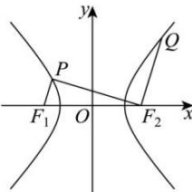

<!-- question-source:start -->
【37】（2024·陕西西安模拟预测）如图，已知 $F_{1}$ ， $F_{2}$ 是双曲线 $C:\frac{x^{2}}{a^{2}}-\frac{y^{2}}{b^{2}}=1$ 的左、右焦点，P,Q为双曲线C上两点，满足 $F_{1}P//F_{2}Q$ ，且 $\left|F_{2}Q\right|=\left|F_{2}P\right|=3\left|F_{1}P\right|$ ，则双曲线C的离心率为\_\_\_\_.

<!-- question-source:end -->

![[Q00008406A1]]
