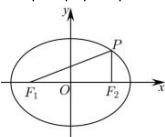

> [!faq]- 全练一本通解析
> **【答案】** D
>
> **【解析】**
> 解析：∵P点椭圆C上的点， $\therefore\left|PF_{1}\right|+\left|PF_{2}\right|=2a$ $PF_{2}\perp F_{1}F_{2}$ ，且 $\angle PF_{1}F_{2}=30^{\circ}$
> 
> $\therefore PF_{2} = \frac{2}{3} a, PF_{1} = \frac{4}{3} a$ 在 $\triangle PF_{1}F_{2}$ 中， $\left|F_{1}F_{2}\right|^{2} + \left|PF_{2}\right|^{2} = \left|PF_{1}\right|^{2}$ 即 $(2c)^{2} + (\frac{2}{3} a)^{2} = (\frac{4}{3} a)^{2}$ ，整理得： $c^{2} = \frac{1}{3} a^{2}$ 即 $e^{2} = \frac{1}{3}, \therefore e = \frac{\sqrt{3}}{3}$
>
> 故选 **D**
