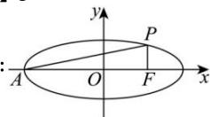

> [!faq]- 全练一本通解析
> **【答案】** C
>
> **【解析】**
> 
> $$
> \mid P F \mid = \frac {b ^ {2}}{a}, \mid A F \mid = a + c
> $$
> $$
> \frac {\frac {b ^ {2}}{a}}{a + c} = \frac {1}{3}, \therefore 3 b ^ {2} = a ^ {2} + a c, \therefore 3 a ^ {2} - 3 c ^ {2} = a ^ {2} + a c,
> $$
> $$
> 3 c ^ {2} + a c - 2 a ^ {2} = 0, \therefore 3 e ^ {2} + e - 2 = 0, \therefore e = \frac {2}{3}
> $$
