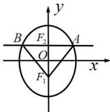

> [!faq]- 全练一本通解析
> **【答案】** D
>
> **【解析】**
> 解析:如图示,
> 
> 由椭圆的对称性知 $\triangle ABF_{1}$ 为等腰直角三角形，所以 $\triangle AF_1F_2$ 为等腰直角三角形.
> 由椭圆的定义知： $\left|AF_1\right| + \left|AF_2\right| = 2a$ ，而 $\left|F_1F_2\right| = \left|AF_2\right| = 2c$ ，所以 $\left|AF_1\right| = 2a - \left|AF_2\right| = 2a - 2c = \sqrt{2}(2c)$ .
> 所以 $a = (\sqrt{2} + 1)c$ ，所以离心率 $e = \frac{c}{a} = \frac{1}{\sqrt{2} + 1} = \sqrt{2} - 1$ .
>
> 故选 **D**
