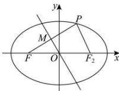

> [!faq]- 全练一本通解析
> **【答案】** A
>
> **【解析】**
> 解析：设 $F$ 关于直线 $l: y = -\sqrt{3}x$ 对称的点为 $P$ ，右焦点为 $F_{2}$ ，再设 $FP$ 的中点为 $M$ ，由于 $O$ 也为 $FF_{2}$ 的中点，故 $OM \parallel PF_{2}$ ， $OM \perp PF$ 焦点 $\triangle PFF_{2}$ 中， $\angle F_{2}PF = \frac{\pi}{2}$ ， $\angle PF_{2}F = \frac{\pi}{3}$ ，所以 $PF = 2c\sin \frac{\pi}{3} = \sqrt{3}c$ ， $PF_{2} = 2c\cos \frac{\pi}{3} = c$ ，由椭圆的定义可知 $PF + PF_{2} = \sqrt{3}c + c = 2a$ ，解得 $e = \frac{c}{a} = \frac{2}{\sqrt{3} + 1} = \sqrt{3} - 1$ . 故选：A.
> 
