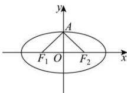

> [!faq]- 全练一本通解析
> **【答案】** D
>
> **【解析】**
> 解析: 设 E 的上顶点为 A,
> 因为 E 上恰有 4 个不同的点 P, 使得 $\triangle PF_{1}F_{2}$ 为直角三角形,
> 所以 $\angle F_{1}AF_{2}<90^{\circ}$ ，则 $\frac{c}{b}<1$ ，所以 $c^{2}<a^{2}-c^{2}$ ，即 $\frac{c^{2}}{a^{2}}<\frac{1}{2}$ 故 E 的离心率的取值范围为 $\left(0,\frac{\sqrt{2}}{2}\right)$ . 故选: D
> 
