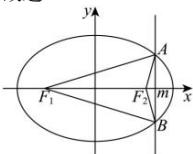

> [!faq]- 全练一本通解析
> **【答案】** D
>
> **【解析】**
> 解析: 因为 $\triangle ABF_{1}$ 的周长为: $\left|AF_{1}\right|+\left|BF_{1}\right|+\left|AB\right|=2a-\left|AF_{2}\right|+2a-\left|BF_{2}\right|+\left|AB\right|=4a+\left|AB\right|-\left(\left|AF_{2}\right|+\left|BF_{2}\right|\right)$
> $\leq 4a + |AB| - |AB| = 4a$ ，当且仅当 $A, F_2, B$ 三点共线时等号成立，即直线 $x = m$ 过点 $F_2$ 时 $\triangle ABF_1$ 的周长最大，此时 $|AF_2| = \frac{b^2}{a}, |AF_1| = 2a - \frac{b^2}{a}$ ，所以 $\frac{|AF_1|}{|AF_2|} = \frac{2a - \frac{b^2}{a}}{\frac{b^2}{a}} = \frac{5}{3}$ ，即 $\frac{b^2}{a^2} = \frac{3}{4}$ ，所以 $e^2 = 1 - \frac{b^2}{a^2} = \frac{1}{4}$ ，即 $e = \frac{1}{2}$ ，故选：D.
> 
