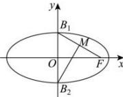

> [!faq]- 全练一本通解析
> **【答案】** C
>
> **【解析】**
> 详解:由已知 $FB_{1}\perp MB_{2}$ ，且 M 是 $FB_{1}$ 的中点
> 则 $\left|B_{1}B_{2}\right|=\left|B_{2}F\right|$ ，即 2b=a，
> 所以 $a^{2}=4b^{2}=4(a^{2}-c^{2})$ 即 $\frac{c^{2}}{a^{2}}=\frac{3}{4}$ ，所以 $e=\frac{c}{a}=\frac{\sqrt{3}}{2}$ . 故选：C.
> 
