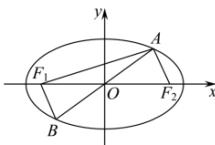

> [!faq]- 全练一本通解析
> **【答案】** C
>
> **【解析】**
> 详解:由椭圆的对称性可得 $\left|AF_{2}\right|=\left|BF_{1}\right|$ ,
> 则 $\left|AF_{1}\right|+\left|AF_{2}\right|=\left|AF_{2}\right|+3\left|AF_{2}\right|=4\left|AF_{2}\right|=2a$ 所以 $\left|AF_{2}\right|=\frac{1}{2}a,\left|AF_{1}\right|=\frac{3}{2}a$ 又 $\left|OA\right|=\left|OF_{2}\right|=\left|OF_{1}\right|$ ，得 $\angle F_{1}AF_{2}=90^{\circ}$ ，
> 所以 $\left|AF_{1}\right|^{2}+\left|AF_{2}\right|^{2}=\frac{1}{4}a^{2}+\frac{9}{4}a^{2}=\frac{5}{2}a^{2}=\left|F_{1}F_{2}\right|=4c^{2}$ 所以 $e=\frac{c}{a}=\sqrt{\frac{5}{8}}=\frac{\sqrt{10}}{4}$ . 故选：C.
> 
