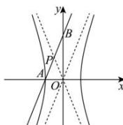

> [!faq]- 全练一本通解析
> **【答案】** B
>
> **【解析】**
> B解析：不妨设双曲线， $\frac{x^2}{a^2} -\frac{y^2}{b^2} = 1(a > 0,b > 0),A(-a,0),B(0,b),$
> 
> $$
> \therefore k _ {A B} = \frac {b}{a}
> $$
> 所以直线 AB 与其中一条渐近线平行，
> 又∵直线AB与另一渐近线相交于点P，
> ∴ $\angle PAO=\angle POA$ ，即 $|AP|=|OP|$ 又∵ $|OP|=|OA|=a$ ∴△PAO为等边三角形，
> $\therefore k_{AB} = \frac{b}{a} = \sqrt{3}, e = \frac{c}{a} = \sqrt{1 + \frac{b^2}{a^2}} = 2$ ，
>
> 故选 **B**.
