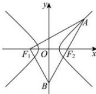

> [!faq]- 全练一本通解析
> **【答案】** A
>
> **【解析】**
> 解析: 设 $\left|F_{2}A\right|=m$ ，则 $\left|BF_{2}\right|=3m,\left|BA\right|=4m$ ，
> 由于 $F_{1}, F_{2}$ 关于 y 轴对称，故 $\left|BF_{1}\right|=\left|BF_{2}\right|=3m$ ，又因为 $\overrightarrow{F_{1}B} \perp \overrightarrow{AB}$ ，
> 
> 所以 $\left|AF_{1}\right|=5m,\left|F_{1}F_{2}\right|=3\sqrt{2}m$ ，所以 2a=4m, $2c=3\sqrt{2}m$ ，所以 $e=\frac{3\sqrt{2}}{4}$ ，
>
> 故选 **A**.
