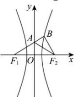

> [!faq]- 全练一本通解析
> **【答案】** D
>
> **【解析】**
> 解析: 如图, 令 $\left|AB\right|=x$ , 由 $\overrightarrow{F_{1}A}=\frac{2}{3}\overrightarrow{F_{1}B}$ , 得 $\left|AF_{1}\right|=\left|AF_{2}\right|=2x$ ,
> 又∵ $AB\perp BF_{2}$ ，则 $\left|BF_{2}\right|=\sqrt{3}x,\left|BF_{1}\right|=3x,\left|BF_{1}\right|-\left|BF_{2}\right|=\left(3-\sqrt{3}\right)x=2a$ 即 $a=\frac{3-\sqrt{3}}{2}x$ ，又由 $\left|F_{1}F_{2}\right|=2c=\sqrt{BF_{1}^{2}+BF_{2}^{2}}=2\sqrt{3}x$ ，得 $c=\sqrt{3}x$ ∴ $e=\frac{c}{a}=\frac{\sqrt{3}x}{\frac{3-\sqrt{3}}{2}x}=\sqrt{3}+1$ ，故选：D.
> 
