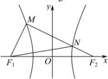

> [!faq]- 全练一本通解析
> **【答案】** C
>
> **【解析】**
> $$
> \left| N F _ {2} \right| = n
> $$
> $$
> \left| M N \right| = 2 n
> $$
> $$
> \left| M F _ {2} \right| = 3 n
> $$
> $$
> \left| M F _ {2} \right| - \left| M F _ {1} \right| = 2 a
> $$
> $$
> \left| M F _ {1} \right| = 3 n - 2 a
> $$
> $$
> \left| M F _ {1} \right| ^ {2} + \left| M F _ {2} \right| ^ {2} = \left| F _ {1} F _ {2} \right| ^ {2}
> $$
> $$
> 9 n ^ {2} + (3 n - 2 a) ^ {2} = 4 c ^ {2} \tag {①}
> $$
> $$
> N F _ {1}
> $$
> $$
> \left| N F _ {1} \right| - \left| N F _ {2} \right| = 2 a
> $$
> $$
> \left| N F _ {1} \right| = 2 a + n
> $$
> $$
> \left| M F _ {1} \right| ^ {2} + \left| M N \right| ^ {2} = \left| N F _ {1} \right| ^ {2}
> $$
> $$
> 4 n ^ {2} + (3 n - 2 a) ^ {2} = (2 a + n) ^ {2} \tag {②}
> $$
> $$
> n = \frac {4}{3} a
> $$
> $$
> 2 0 a ^ {2} = 4 c ^ {2}
> $$
> $$
> \frac {c}{a} = \sqrt {5}
> $$
> 
>
> 故选 **C**
