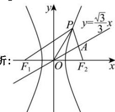

> [!faq]- 全练一本通解析
> **【答案】** A
>
> **【解析】**
> 
> 如图所示, 设直线 $y=\frac{\sqrt{3}}{3}x$ 交 $PF_{2}$ 于 A，
> 连接 OP， $PF_{1}$ ，
> 由已知线段 $PF_{2}$ 被直线 $y = \frac{\sqrt{3}}{3} x$ 垂直平分，
> 可知 $\left|OF_1\right| = \left|OF_2\right| = \left|OP\right|$ ， $OA\bot PF_2$ ，
> 所以 $PF_{1}\bot PF_{2}$ 所以 $\triangle PF_1F_2$ 是以 $F_{1}F_{2}$ 为斜边的直角三角形，
> 又直线 $y = \frac{\sqrt{3}}{3} x$ 的斜率为 $\frac{\sqrt{3}}{3}$ 可得 $\angle POF_2 = \frac{\pi}{6}$ ，所以 $\angle OF_2P = \frac{\pi}{3}$ 所以 $\left|PF_2\right| = \left|OP\right| = \left|OF_1\right| = \left|OF_2\right| = c$ ， $\left|PF_1\right| = \sqrt{3}\left|PF_2\right| = \sqrt{3} c$ 由双曲线定义可知 $\left|PF_1\right| - \left|PF_2\right| = 2a$ ，即 $\left|PF_1\right| = 2a + c$ 所以 $2a + c = \sqrt{3} c$ ，整理可得 $e = \frac{c}{a} = \frac{2}{\sqrt{3} - 1} = \sqrt{3} +1$ ，
>
> 故选 **A**.
