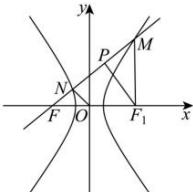

> [!faq]- 全练一本通解析
> **【答案】** B
>
> **【解析】**
> B解析：如图所示，双曲线 $E:x^{2} - y^{2} = 1$ 的右焦点为 $F_{1}$ ，MF的中点为 $P$ 连接 $MF_{1}$ ， $PF_{1}$ 因为 $\overline{MN} = 3\overline{NF}$ ， $O$ 为 $FF_{1}$ 的中点，所以 $ON / / PF_{1}$ ，则 $MF\bot PF_{1}$ ，可得 $\left|MF_1\right| = \left|FF_1\right| = 2c$ 又因为 $\tan \angle MFF_{1} = \frac{\sqrt{7}}{3}$ ，所以 $\cos \angle MFF_{1} = \frac{\left|M F\right|}{2\left|FF_{1}\right|} = \frac{3}{4}$ 则 $\left|MF\right| = 3c$ ， $\left|MF\right| - \left|MF_1\right| = 3c - 2c = c = 2a$ ，可得 $e = \frac{c}{a} = 2$ 所以 $E$ 的离心率为2，故选：B.
> 
