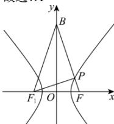

> [!faq]- 全练一本通解析
> **【答案】** A
>
> **【解析】**
> 解析: 设双曲线的左焦点为 $F_{1}$ ，连接 $BF_{1}$ ， $F_{1}P$ ，
> 由 $\overrightarrow{BP}=4\overrightarrow{PF}$ ，则 $\overrightarrow{BF}=5\overrightarrow{PF}$ ，又 $\overrightarrow{BP}\cdot\overrightarrow{BF}=4\left|\overrightarrow{PF}\right|\times5\left|\overrightarrow{PF}\right|=20a^{2}$ ，
> 所以 $\left|PF\right|=a$ ，则 $\left|BP\right|=4a,\left|BF\right|=5a$ 根据双曲线的性质有 $\left|BF_{1}\right|=5a$ ，又 $\left|F_{1}P\right|-\left|PF\right|=2a$ ，所以 $\left|F_{1}P\right|=3a$ ，
> 所以 $\left|BF_{1}\right|^{2}=\left|BP\right|^{2}+\left|F_{1}P\right|^{2}$ ，所以 $PF_{1}\perp BP$ ，即 $\angle FPF_{1}=\frac{\pi}{2}$ 又 $\left|FF_{1}\right|^{2}=\left|PF\right|^{2}+\left|F_{1}P\right|^{2}$ ，即 $10a^{2}=4c^{2}$ ，即 $\frac{c^{2}}{a^{2}}=\frac{10}{4}$ ，所以 $e=\frac{c}{a}=\frac{\sqrt{10}}{2}$ .
> 故选：A
> 
