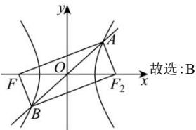

> [!faq]- 全练一本通解析
> **【答案】** B
>
> **【解析】**
> 解析: 设双曲线右焦点为 $F_{2}(c,0)$ ，连接 $AF_{2}$ ，
> 由对称性可知， $\left|AF_{2}\right|=\left|BF\right|$ ， $\left|OF_{2}\right|=\left|OF\right|$ ， $\left|OA\right|=\left|OB\right|$ ，
> 因为 $\left|OA\right|=\left|OF\right|$ ，所以 $\left|OF_{2}\right|=\left|OF\right|=\left|OA\right|=\left|OB\right|$ ，
> 故四边形 $AFBF_{2}$ 为矩形， $AF_{2} \perp AF$ ，
> 因为 $\left|AF\right|\cdot\left|BF\right|=2$ ，所以 $\left|AF\right|\cdot\left|AF_{2}\right|=2$ ，
> 由双曲线定义可得 $\left|AF\right|-\left|AF_{2}\right|=2a=2\sqrt{3}$ ，
> 由勾股定理得 $\left|AF\right|^{2}+\left|AF_{2}\right|^{2}=\left|F_{1}F_{2}\right|^{2}=\left(2\sqrt{3+b^{2}}\right)^{2}=12+4b^{2}$ ，
> 由题意得 $\left(\left|AF\right|-\left|AF_{2}\right|\right)^{2}+2\left|AF\right|\cdot\left|AF_{2}\right|=\left|AF\right|^{2}+\left|AF_{2}\right|^{2}$ 即 $12+4=12+4b^{2}$ ，解得 $b^{2}=1$ ，
> 故 $c^{2}=3+b^{2}=4$ ，解得 c=2，
> 离心率为 $\frac{c}{a}=\frac{2}{\sqrt{3}}=\frac{2\sqrt{3}}{3}$
> 
