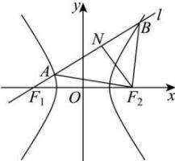

> [!faq]- 全练一本通解析
> **【答案】** D
>
> **【解析】**
> 解析: 过 $F_{2}$ 作 $F_{2}N \perp AB$ 于点 N, 如图,
> 
> 设 $\left|F_{2}A\right|=\left|F_{2}B\right|=m$ 因为直线 l 的倾斜角为 $\frac{\pi}{6}$ ， $\left|F_{1}F_{2}\right|=2c$ 所以在 Rt△ $F_{1}F_{2}N$ 中， $\left|NF_{2}\right|=c,\left|NF_{1}\right|=\sqrt{3}c$ 由双曲线的定义得 $\left|F_{1}B\right|-\left|F_{2}B\right|=2a,\left|F_{2}A\right|-\left|F_{1}A\right|=2a$ 所以 $\left|F_{1}B\right|=2a+m,\left|F_{1}A\right|=m-2a$ 所以 $\left|AB\right|=\left|F_{1}B\right|-\left|F_{1}A\right|=4a$ 因为 $\left|F_{2}A\right|=\left|F_{2}B\right|=m$ 所以 $\triangle AF_{2}B$ 为等腰三角形，
> 又因为 $F_{2}N \perp AB$ 所以 N 为 AB 的中点，
> 所以 $\left|AN\right|=2a$ 可得 $\left|F_{1}A\right|=\left|NF_{1}\right|-\left|AN\right|=\sqrt{3}c-2a$ 因此 $m=\sqrt{3}c$ 在 Rt△ $ANF_{2}$ 中， $\left|F_{2}A\right|^{2}=\left|NF_{2}\right|^{2}+\left|AN\right|^{2}$ 所以 $\left(\sqrt{3}c\right)^{2}=4a^{2}+c^{2}$ ，即 $c=\sqrt{2}a$ ，所以 $e=\frac{c}{a}=\sqrt{2}$ 。
>
> 故选 **D**.
