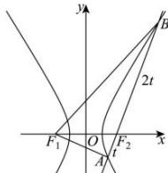

> [!faq]- 全练一本通解析
> **【答案】** B
>
> **【解析】**
> 解析:如图:设 $\left|AF_{2}\right|=t$ ，则 $\left|BF_{2}\right|=2t$
> 
> 根据双曲线的定义, 可得 $\left|AF_{1}\right|=2a+t,\left|BF_{1}\right|=2a+2t$ 因为 $\overrightarrow{AF_{1}}\cdot\overrightarrow{AB}=0$ ，所以 $\angle BAF_{1}=90^{\circ}$ 所以 $\left\{\begin{aligned}&\left|\left|AF_{1}\right|^{2}+\left|AF_{2}\right|^{2}=\left|F_{1}F_{2}\right|^{2}\\&\left|\left|AF_{1}\right|^{2}+\left|AB\right|^{2}=\left|BF_{1}\right|^{2}\end{aligned}\right.\Rightarrow\left\{\begin{aligned}&(2a+t)^{2}+t^{2}=(2c)^{2}\\&(2a+t)^{2}+(3t)^{2}=(2a+2t)^{2}\end{aligned}\right.$ 由 $(2a+t)^{2}+(3t)^{2}=(2a+2t)^{2}\Rightarrow2a=3t$ 代入 $(2a+t)^{2}+t^{2}=(2c)^{2}$ 可得 $17a^{2}=9c^{2}\Rightarrow e=\frac{c}{a}=\frac{\sqrt{17}}{3}$ .
>
> 故选 **B**
