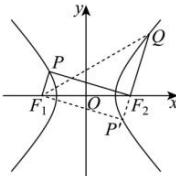

> [!faq]- 全练一本通解析
> **【解析】**
> $\frac{\sqrt{10}}{2}$ 解析: 延长 $QF_{2}$ 与双曲线交于点 $P'$ ,
> 因为 $F_{1}P//F_{2}P'$ ，根据对称性可知 $\left|F_{1}P\right|=\left|F_{2}P'\right|$ 设 $\left|F_{2}P'\right|=\left|F_{1}P\right|=t$ ，则 $\left|F_{2}P\right|=\left|F_{2}Q\right|=3t$ 可得 $\left|F_{2}P\right|-\left|F_{1}P\right|=2t=2a$ ，即 t=a，
> 所以 $\left|P'Q\right|=4t=4a$ ，则 $\left|QF_{1}\right|=\left|QF_{2}\right|+2a=5a,\left|F_{1}P'\right|=\left|F_{2}P\right|=3a$ 即 $\left|P'Q\right|^{2}+\left|F_{1}P'\right|^{2}=\left|QF_{1}\right|^{2}$ ，可知 $\angle F_{1}P'Q=\angle F_{1}PF_{2}=90^{\circ}$ 在 $\triangle P'F_{1}F_{2}$ 中，由勾股定理得 $\left|F_{2}P'\right|^{2}+\left|F_{1}P'\right|^{2}=\left|F_{1}F_{2}\right|^{2}$ 即 $a^{2}+(3a)^{2}=4c^{2}$ ，解得 $e=\frac{c}{a}=\frac{\sqrt{10}}{2}$ .
> 故答案为: $\frac{\sqrt{10}}{2}$
> 
