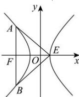

> [!faq]- 全练一本通解析
> **【解析】**
> $(1,\sqrt{3} +1)$
> 解析:如图所示,根据双曲线的对称性得,在 $\triangle EAB$ 中 $\angle EAB = \angle EBA$ ,
> 又因为 $\angle AEB < 120^{\circ}$ ,
> 所以在 Rt△AEF 中， $\angle AEF < 60^{\circ}$ 即 $\tan\angle AEF=\frac{|AF|}{|EF|}<\sqrt{3}$ 所以 $|AF|<\sqrt{3}|EF|$ 又因为 AB 为通径, 即 $|AF|=\frac{b^{2}}{a}, |EF|=a+c$ 所以 $\frac{b^{2}}{a}<\sqrt{3}(a+c)$ ，且 $c^{2}=a^{2}+b^{2}$ 所以 $c^{2}-a^{2}<\sqrt{3}(a^{2}+ac)$ 即 $c^{2}-\sqrt{3}ac-(1+\sqrt{3})a^{2}<0$ 即 $e^{2}-\sqrt{3}e-\left(1+\sqrt{3}\right)<0$ 解得 -1<e< $\sqrt{3}$ +1，
> 又因为双曲线离心率 e>1，
> 所以该双曲线的离心率取值范围为： $1<e<\sqrt{3}+1$ .
> 故答案为： $(1,\sqrt{3}+1)$ .
> 
