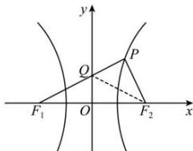

> [!faq]- 全练一本通解析
> **【解析】**
> $(\sqrt{2},2)$
> 解析: 设 $PF_{1}$ 与 y 轴交点 Q，连接 $QF_{2}$ ，由对称性可知， $\angle QF_{1}F_{2} = \angle QF_{2}F_{1}$ ，如图所示，
> 
> 又∵ $\angle PF_{2}F_{1}=3\angle PF_{1}F_{2}$ ，∴ $\angle PF_{2}Q=\angle PQF_{2}=2\angle PF_{1}F_{2}$ ，∴ $|PQ|=|PF_{2}|$ .
> 又∵ $\left|PF_{1}\right|-\left|PF_{2}\right|=2a$ ，∴ $\left|PF_{1}\right|-\left|PF_{2}\right|=\left|PF_{1}\right|-\left|PQ\right|=\left|QF_{1}\right|=2a$ 在 Rt△QOF₁ 中， $\left|QF_{1}\right|>\left|OF_{1}\right|$ ，∴ 2a>c，∴ $e=\frac{c}{a}<2$ 由 $\angle PF_{2}F_{1}=3\angle PF_{1}F_{2}$ ，且三角形的内角和为 $180^{\circ}$ ，∴ $\angle PF_{1}F_{2}<\frac{180^{\circ}}{4}=45^{\circ}$ ∴ $\cos\angle PF_{1}F_{2}=\frac{\left|OF_{1}\right|}{\left|QF_{1}\right|}>\cos45^{\circ}$ ，即 $\frac{c}{2a}>\frac{\sqrt{2}}{2}$ ，则 $e=\frac{c}{a}>\sqrt{2}$ .
> 综上， $e\in(\sqrt{2},2)$ . 故答案为： $(\sqrt{2},2)$ .
