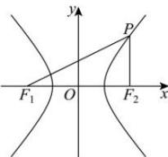

> [!faq]- 全练一本通解析
> **【答案】** D
>
> **【解析】**
> 解析:由双曲线 E 的对称性不妨取 P 为 E 的右支上一点,
> 可得 $\left|PF_{1}\right|-\left|PF_{2}\right|=2a$ ，即 $\left|PF_{1}\right|=\left|PF_{2}\right|+2a$ 又由由 $\left|PF_{1}\right|+\left|PF_{2}\right|\geq4b$ 可得 $2\left|PF_{2}\right|+2a\geq4b$ ，即 $\left|PF_{2}\right|\geq2b-a$ 因为 $\left|PF_{2}\right|$ 的最小值为 c-a，（当点 P 为 E 的右顶点时， $\left|PF_{2}\right|$ 取得最小值）
> 故只需 $c-a\geq2b-a$ ，即 $c\geq2b$ 。
> 所以 $c^{2} \geq 4b^{2} = 4c^{2} - 4a^{2}$ ，得 $\frac{c}{a} \leq \frac{2\sqrt{3}}{3}$ ，故 E 的离心率的取值范围为 $\left(1,\frac{2\sqrt{3}}{3}\right]$ . 故选:D.
> 
