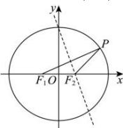

> [!faq]- 全练一本通解析
> **【解析】**
> $\frac{1}{3}$
> 解析:设椭圆 C 的半焦距为 $c \in (0, a)$
> 由题意可知： $\left|PF_2\right| = \left|F_1F_2\right| = 2c$
> 
> 根据存在性结合椭圆性质可知： $a - c\leq 2c\leq a + c$ ，解得 $\frac{1}{3} a\leq c <   a$ 可得 $C$ 的离心率 $e = \frac{c}{a}\in \left[\frac{1}{3},1\right)$ ，所以 $C$ 的离心率的最小值是 $\frac{1}{3}$ 故答案为： $\frac{1}{3}$
